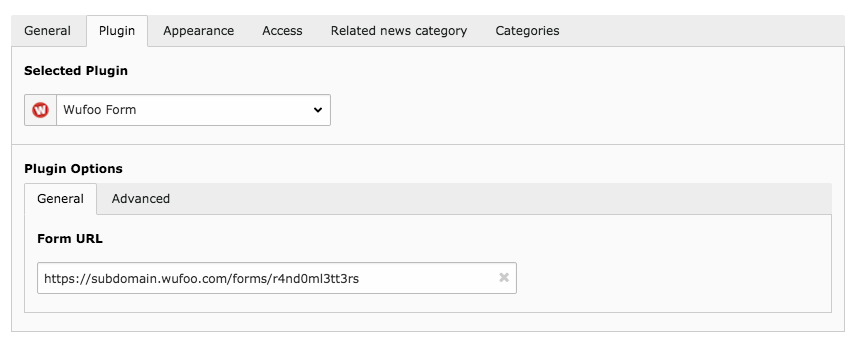
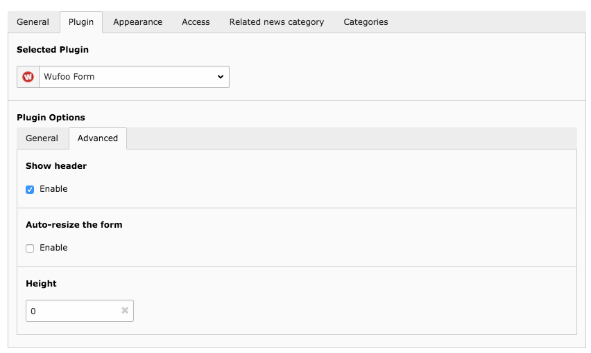

.. include:: ../Includes.txt

.. _section-user-manual:

Users Manual
============

.. _section-import-and-display

Import and display a form
-------------------------

To import and display a form, follw these steps:

#. In your account on https://www.wufoo.com/ find the form you want to add to
   your TYPO3 website and copy its "share-link" using the **Permanent Link**
   (see `Wufoo Help Center
   <https://help.wufoo.com/articles/en_US/kb/Form-Links>`__ for more information
   on how to do this, it's very easy)
#. Then, in TYPO3, using the page module, go to the desired page and add a
   content element of type "Wufoo Form" (which can be found in the tab
   "Plugins")
#. As the new content element opens, go to the tab "Plugin" and paste the
   previously copied form url into the field "Form URL" and click save.

.. important::

   Be sure to always use the **Permanent Link** when generating the "share link"
   in the form share dialog on wufoo.com. This ensures that your form will not
   stop from being displayed, even when you change its name.

   General plugin options

.. _section-advanced-options

Advanced options
----------------

Show header
^^^^^^^^^^^

If this option is not enabled, the form will be shown without header. It is
enabled by default.

Auto-resize the form
^^^^^^^^^^^^^^^^^^^^

If this option is not enabled, the form will not adjust itself to the needed
size. It is enabled by default.

Height
^^^^^^

This option only shows up, when option **Auto-resize the form** is disabled. Add
a numeric value greater the 0 to define a fixed height in pixels for the form.

.. important::

    **Caution:** disabling auto-resizing and setting the height manually could
    lead to bad form visibility or ugly/unwanted scrollbars. Use these options
    only if you know what you do!

   Advanced plugin options
